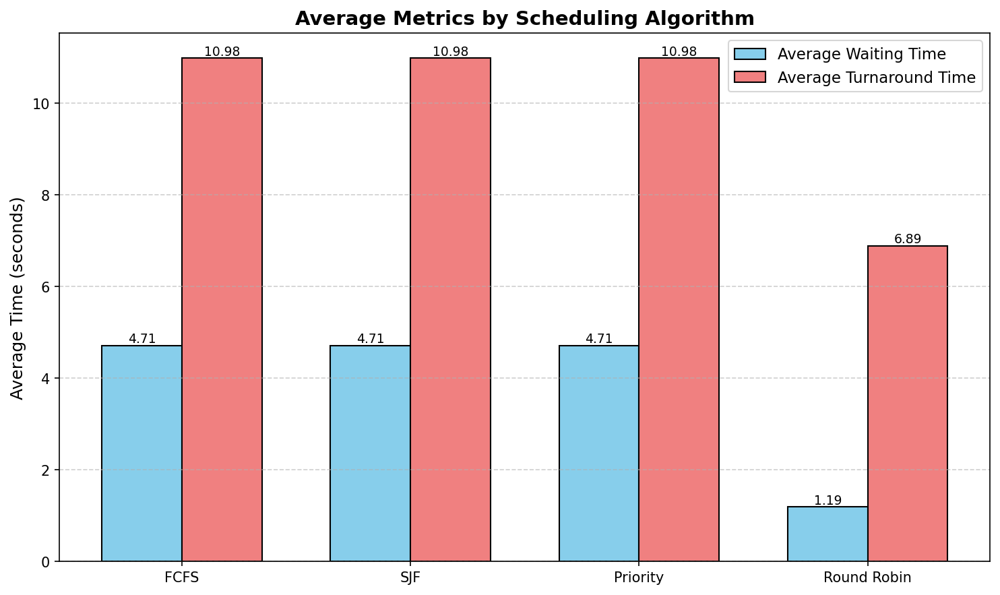

# Chronos - Multithreaded CPU Scheduler Simulator

A multithreaded CPU scheduling simulator written in C++17 that simulates different scheduling algorithms using multithreading to represent multiple CPU cores. It supports FCFS, SJF, Priority, and Round Robin scheduling algorithms with metrics collection and visualization.

## Features

- **Multiple Scheduling Algorithms**: First-Come-First-Served (FCFS), Shortest Job First (SJF), Priority-based, and Round Robin (RR)
- **Multithreaded Simulation**: Each CPU core is represented by a worker thread with independent time tracking
- **Comprehensive Metrics**: Tracks waiting time, turnaround time, CPU utilization (≤100%), and context switches
- **CSV Export**: Exports per-job metrics and aggregate summaries for analysis
- **Visualization**: Python/Matplotlib scripts generate Gantt charts and comparison graphs
- **Compare-All Mode**: Automatically runs all 4 algorithms on the same job set for performance comparison

## Building

### Prerequisites

- C++17 compatible compiler (GCC 7+, Clang 5+, or MSVC 2017+)
- Python 3.6+ with matplotlib and numpy (for visualizations)

### Build Instructions

#### Manual Compilation

```bash
g++ -std=c++17 -Iinclude \
    src/*.cpp main.cpp \
    -o schedsim \
    -pthread
```

On macOS with Clang:
```bash
clang++ -std=c++17 -Iinclude \
        src/*.cpp main.cpp \
        -o schedsim \
        -pthread
```

## Usage

### Command-Line Options

- `--algo, -a <ALGO>`: Scheduling algorithm (FCFS, SJF, Priority, RR)
- `--cores, -c <NUM>`: Number of CPU cores (positive integer)
- `--jobs, -j <NUM>`: Number of jobs to generate (positive integer)
- `--quantum, -q <NUM>`: Time quantum for Round Robin (positive integer, **required for single RR runs**)
- `--compare-all`: Run all 4 algorithms on the same job set and compare results
- `--help, -h`: Show help message

### Single Algorithm Mode

Run one algorithm with detailed per-job metrics:

```bash
# FCFS example
./schedsim --cores 2 --algo FCFS --jobs 5

# SJF example
./schedsim --cores 2 --algo SJF --jobs 5

# Priority example
./schedsim --cores 2 --algo PRIORITY --jobs 5

# Round Robin example (quantum required)
./schedsim --cores 2 --algo RR --quantum 2 --jobs 5
```

**Outputs generated**:
- `output/metrics.csv` (per-job data)
- `output/summary.csv` (aggregate metrics)
- All 3 visualization charts available

### Compare-All Mode

Run all algorithms on the same job set for comparison:

```bash
./schedsim --cores 2 --jobs 10 --compare-all
```

**Optional**: Specify quantum for Round Robin (default is 2):
```bash
./schedsim --cores 2 --jobs 10 --compare-all --quantum 3
```

**Outputs generated**:
- ❌ No `metrics.csv` (intentionally omitted to avoid duplication)
- ✅ `output/summary.csv` (aggregate comparison for all 4 algorithms)
- ✅ Only `avg_metrics.png` and `utilization.png` available
- ❌ No Gantt chart (requires per-job metrics)

**Rationale**: In compare-all mode, the same job set runs 4 times (once per algorithm). Per-job metrics would create a massive CSV with duplicate job IDs. The mode is designed for **aggregate comparison**, not detailed timeline analysis.

## Output

### Console Output

The scheduler prints a formatted table showing job execution details and aggregate metrics.

**Example output (Round Robin)**:
```
Algorithm: Round Robin (Quantum = 2)
------------------------------------------------
Job | Arrival | Burst | Start | Finish | Wait | Turnaround
------------------------------------------------
  2 |     1.0 |   4.7 |   1.0 |    8.7 |  0.0 |        7.7
  4 |     3.7 |   5.6 |   3.7 |    8.6 |  0.0 |        4.9
  1 |     7.2 |   4.0 |  10.7 |   14.6 |  3.5 |        7.5
  5 |     6.0 |   6.8 |   6.0 |   15.4 |  0.0 |        9.4
  3 |     8.1 |   2.6 |  10.6 |   13.1 |  2.4 |        5.0
------------------------------------------------
Average Waiting Time: 1.19
Average Turnaround Time: 6.89
CPU Utilization: 100.00%
Context Switches: 12
```

### CSV Files

Results are exported to the `output/` directory.

#### metrics.csv (Single Algorithm Mode Only)

Per-job metrics with detailed execution information.

**Example** (from actual output):
```csv
algorithm,job_id,arrival_time,burst_time,priority,start_time,finish_time,waiting_time,turnaround_time,remaining_time
Round Robin,2,1.01,4.67,3,1.01,8.69,0.00,7.68,0.00
Round Robin,4,3.66,5.55,4,3.66,8.56,0.00,4.90,0.00
Round Robin,1,7.15,3.95,1,10.69,14.64,3.54,7.49,0.00
Round Robin,5,6.02,6.78,2,6.02,15.42,0.00,9.40,0.00
Round Robin,3,8.13,2.59,2,10.56,13.14,2.43,5.01,0.00
```

#### summary.csv (Both Modes)

Aggregate metrics for algorithm comparison.

**Example** (from actual compare-all output):
```csv
algorithm,avg_waiting_time,avg_turnaround_time,cpu_utilization,context_switches,num_jobs,makespan
FCFS,4.71,10.98,100.00,3,5,8.39
SJF,4.71,10.98,100.00,3,5,8.39
Priority,4.71,10.98,100.00,3,5,8.39
Round Robin,1.19,6.89,100.00,12,5,11.75
```

**Metrics Explanation**:
- **avg_waiting_time**: Average time jobs waited before execution (seconds)
- **avg_turnaround_time**: Average time from arrival to completion (seconds)
- **cpu_utilization**: Percentage of CPU capacity used (0-100%)
- **context_switches**: Number of job dispatches minus initial core dispatches
  - Non-preemptive (FCFS, SJF, Priority): Typically `num_jobs - num_cores`
  - Preemptive (RR): Much higher due to time-slicing
- **makespan**: Total execution time from first job start to last job finish (seconds)

## Visualization

Generate visualizations from the CSV files:

```bash
python3 tools/visualize.py
```

The script automatically handles missing files gracefully and generates available charts.

### Visualization Requirements

Install Python dependencies:

```bash
pip install matplotlib numpy
```

### Generated Charts

The visualization script generates charts based on available data:

#### 1. Gantt Chart (Single Algorithm Mode Only)

Shows job execution timeline with color-coded jobs and waiting periods.


**Features**:
- X-axis: Time (seconds)
- Y-axis: Job IDs
- Solid bars: Execution periods
- Hatched bars: Waiting periods
- Color-coded by job ID

**Generated when**: Running single algorithm mode (requires `metrics.csv`)

#### 2. Average Metrics Comparison

Compares average waiting and turnaround times across algorithms.



**Features**:
- X-axis: Algorithms (FCFS, SJF, Priority, RR)
- Y-axis: Average Time (seconds)
- Blue bars: Average Waiting Time
- Coral bars: Average Turnaround Time
- Value labels on bars

**Generated when**: Always (requires `summary.csv`)

#### 3. CPU Utilization vs Context Switches

Dual-axis chart showing efficiency vs overhead.


**Features**:
- X-axis: Algorithms
- Left Y-axis: CPU Utilization (%) - blue bars
- Right Y-axis: Context Switches - red line
- Value labels for both metrics

**Generated when**: Always (requires `summary.csv`)

### Chart Availability by Mode

| Mode | Gantt Chart | Avg Metrics | Utilization |
|------|-------------|-------------|-------------|
| **Single Algorithm** | ✅ Yes | ✅ Yes | ✅ Yes |
| **Compare-All** | ❌ No | ✅ Yes | ✅ Yes |

## Example Run & Results

### Single Algorithm Example

```bash
./schedsim --cores 2 --algo RR --quantum 2 --jobs 5
python3 tools/visualize.py
```

**Console Output**:
```
Algorithm: Round Robin (Quantum = 2)
------------------------------------------------
Job | Arrival | Burst | Start | Finish | Wait | Turnaround
------------------------------------------------
  2 |     1.0 |   4.7 |   1.0 |    8.7 |  0.0 |        7.7
  4 |     3.7 |   5.6 |   3.7 |    8.6 |  0.0 |        4.9
  1 |     7.2 |   4.0 |  10.7 |   14.6 |  3.5 |        7.5
  5 |     6.0 |   6.8 |   6.0 |   15.4 |  0.0 |        9.4
  3 |     8.1 |   2.6 |  10.6 |   13.1 |  2.4 |        5.0
------------------------------------------------
Average Waiting Time: 1.19
Average Turnaround Time: 6.89
CPU Utilization: 100.00%
Context Switches: 12
Metrics exported to:
  - output/metrics.csv
  - output/summary.csv
```

**Files Created**:
```
output/
├── metrics.csv          (per-job execution data)
├── summary.csv          (aggregate metrics)
├── gantt_chart.png      (job timeline visualization)
├── avg_metrics.png      (waiting/turnaround comparison)
└── utilization.png      (CPU % and context switches)
```

### Compare-All Example

```bash
./schedsim --cores 2 --jobs 10 --compare-all
python3 tools/visualize.py
```

**Console Output**:
```
========================================
Running All Algorithms for Comparison
========================================

Running FCFS...
Running SJF...
Running Priority...
Running Round Robin...

========================================
Comparison complete!
Results written to output/summary.csv
========================================
```

**Files Created**:
```
output/
├── summary.csv          (comparison data for all 4 algorithms)
├── avg_metrics.png      (algorithm comparison chart)
└── utilization.png      (efficiency comparison chart)
```

**Note**: No `metrics.csv` or `gantt_chart.png` in compare-all mode (by design).

## Design Overview

### Core Components

- **Job**: Represents a process with arrival time, burst time, priority, and execution timestamps
- **ISchedulingPolicy**: Abstract interface for scheduling algorithms
- **SchedulerEngine**: Main scheduling loop that coordinates job execution
- **WorkerPool**: Manages worker threads representing CPU cores (each with independent time tracking)
- **MetricsCollector**: Tracks and aggregates performance metrics
- **FileWriter**: Exports metrics to CSV files
- **AlgorithmComparator**: Runs multiple algorithms for comparison in compare-all mode

### Scheduling Algorithms

1. **FCFS (First-Come-First-Served)**: Non-preemptive, selects jobs in order of arrival
2. **SJF (Shortest Job First)**: Non-preemptive, selects job with shortest burst time from ready queue
3. **Priority**: Non-preemptive, selects job with highest priority value
4. **Round Robin**: Preemptive, time-sliced scheduling with configurable quantum

**Important**: Algorithms only select from jobs that have already arrived (ready queue). They cannot "look ahead" to future arrivals.

### Concurrency Model

- Each CPU core is represented by a worker thread
- Each core tracks its own local time independently (prevents timing conflicts)
- Shared ready queue protected by mutex
- Condition variables signal when jobs become available
- Thread-safe metrics collection with atomic counters

### Metrics Calculations

- **Waiting Time** = `start_time - arrival_time`
- **Turnaround Time** = `finish_time - arrival_time`
- **Makespan** = `max(finish_time) - min(start_time)`
- **CPU Utilization** = `total_cpu_time / (makespan × num_cores)` (always ≤ 100%)
- **Context Switches** = `max(0, num_dispatches - num_cores)`

## Testing

### Quick Test

```bash
# Build
g++ -std=c++17 -Iinclude src/*.cpp main.cpp -o schedsim -pthread

# Test single algorithm
./schedsim --cores 2 --algo FCFS --jobs 5

# Test comparison
./schedsim --cores 2 --jobs 10 --compare-all

# Generate visualizations
python3 tools/visualize.py
```

### Sample Test Cases

1. **Basic FCFS**: Verify jobs execute in arrival order
   ```bash
   ./schedsim --cores 1 --algo FCFS --jobs 5
   ```

2. **SJF Optimization**: Verify shortest jobs from ready queue execute first
   ```bash
   ./schedsim --cores 2 --algo SJF --jobs 10
   ```

3. **Round Robin Preemption**: Verify quantum time slicing works correctly
   ```bash
   ./schedsim --cores 2 --algo RR --quantum 2 --jobs 5
   ```

4. **Algorithm Comparison**: Compare all algorithms on same job set
   ```bash
   ./schedsim --cores 4 --jobs 20 --compare-all
   ```

### Stress Testing

Test with larger job sets:

```bash
./schedsim --cores 4 --algo RR --quantum 2 --jobs 100
```

## Troubleshooting

### Build Issues

- **Missing pthread**: Add `-pthread` flag to compiler command
- **C++17 not supported**: Update your compiler (GCC 7+, Clang 5+, MSVC 2017+)

### Runtime Issues

- **"Error: Quantum required for Round Robin"**: Add `--quantum <NUM>` flag when running RR directly
- **No output files**: Ensure `output/` directory exists or has write permissions
- **Visualization errors**: 
  - Check that matplotlib and numpy are installed: `pip install matplotlib numpy`
  - Verify CSV files exist in `output/` directory
  - For compare-all, Gantt chart will be skipped (expected behavior)
